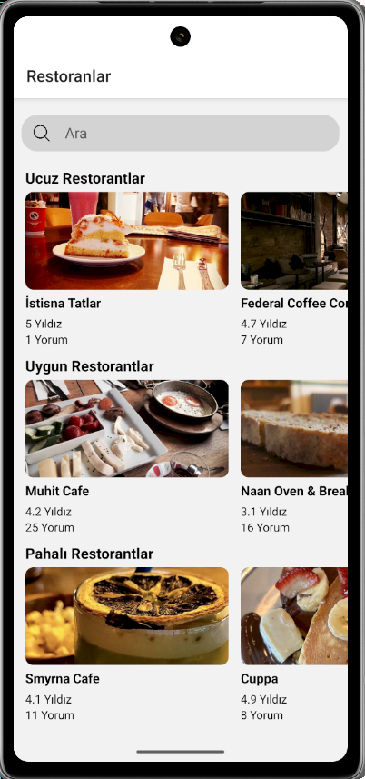

# 🍽️ RestaurantApp

**RestaurantApp**, React Native kullanılarak geliştirilen, kullanıcıların restoranları arayıp inceleyebileceği bir mobil uygulamadır.

---

## 🚀 Özellikler

- 🔍 Restoran arama özelliği  
- 📋 Detaylı restoran bilgileri  
- ⭐ Yorum ve puan görüntüleme  
- 🧭 Kategorilere göre sınıflandırma  
- ⚡ Hızlı ve kullanıcı dostu arayüz  

---

## 📱 Ekran Görüntüleri

### 🔍 Restoran Arama
  


### 📋 Restoran Detayları
  


### 🏠 Ana Sayfa


---

## 🛠️ Kullanılan Teknolojiler

- [React Native](https://reactnative.dev/)
- [React Navigation](https://reactnavigation.org/)
- [JavaScript](https://developer.mozilla.org/en-US/docs/Web/JavaScript)

---

## ⚙️ Kurulum ve Çalıştırma

> Başlamadan önce [React Native ortam kurulum rehberi](https://reactnative.dev/docs/environment-setup) adımlarını tamamlayın.

### 1. Depoyu klonlayın:

```bash
git clone https://github.com/emre478/RestaurantApp.git
cd RestaurantApp
